# Практическая работа  №3

### Задание
Написать программу генерации монохромной BMP-картинки на основе вашего варианта.

**Вход программы:**
* Вариант 0:
 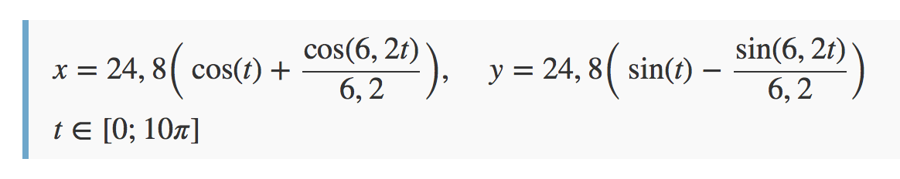
* Вариант 1:
 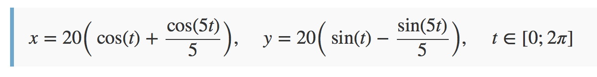
* Вариант 2:
 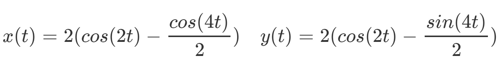 t ∈ \[0; 4𝜋\]
* Вариант 3:
 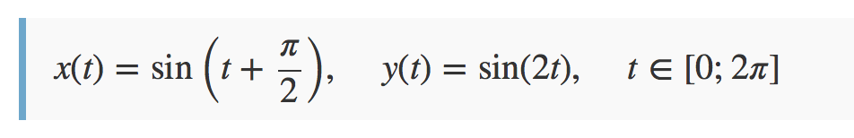
* Вариант 4:
 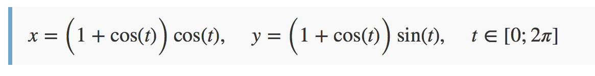
* Вариант 5:
 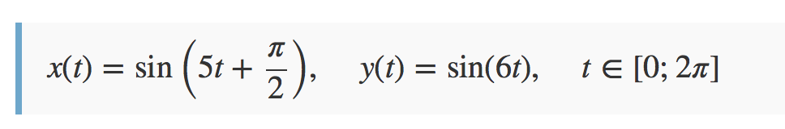
* Вариант 6:
 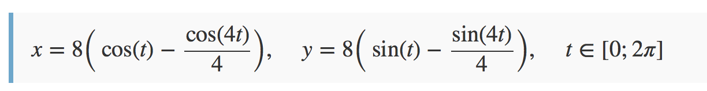
* Вариант 7:
 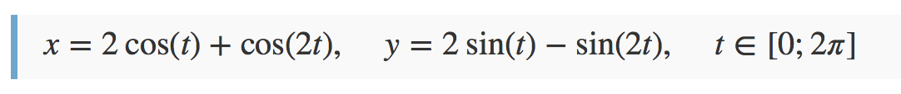
* Вариант 8:
 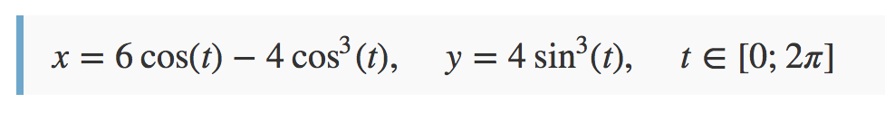
* Вариант 9:
 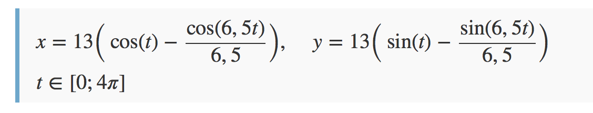
* Вариант 10:
 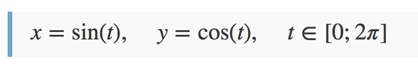
* Вариант 11:
 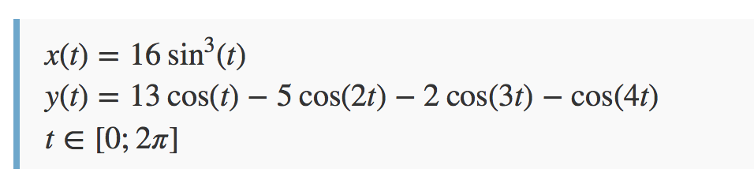
* Вариант 12:
 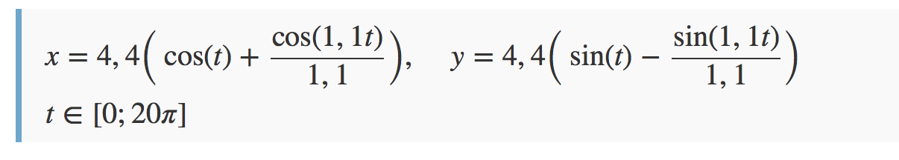
* Вариант 13:
  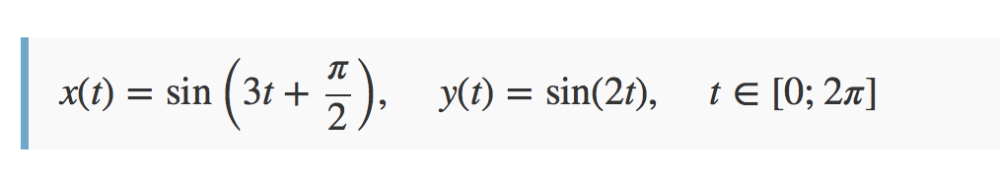
* Вариант 14:
 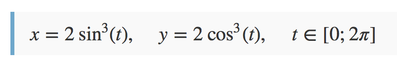
* Вариант 15:
 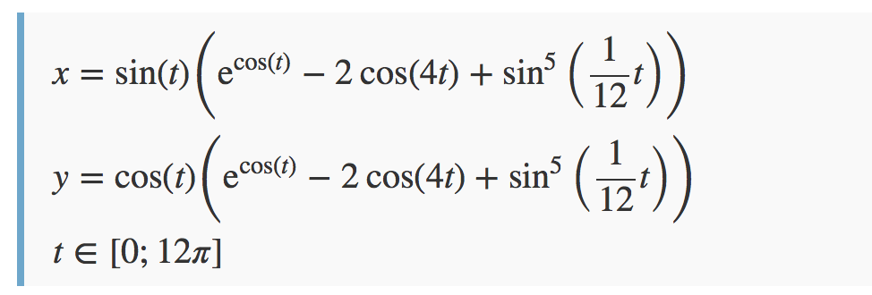
* Вариант 16:
 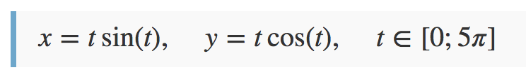
* Вариант 17:
 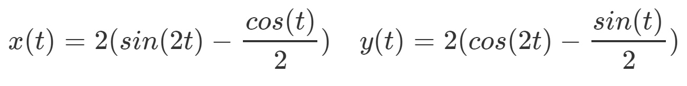 t ∈ \[0; 10𝜋\]

**Соответствие варианта и фамилии**
Вариант| Студент  
-------------|-------------
1 | Антонов Данила Владимирович
2 | Берзейтис Александр Николаевич
3 | Богомолов Владимир Валентинович
4 | Варванин Сергей Сергеевич
5 | Грузликов Александр Михайлович
6 | Зайцев Олег Владимирович
7 | Иванов Дмитрий Павлович
8 | Крохмаль Максим Игоревич
9 | Крючков Роман Леонидович
10 | Литуненко Елизавета Геннадьевна
11 | Лукоянов Егор Васильевич
12 | Мищенко Алина Вадимовна
13 | Мухин Дмитрий Алексеевич
14 | Поляков Дмитрий Юрьевич
15 | Семенов Илья Вячеславович
16 | Скородумов Юрий Михайлович
17 | Столярова Александра Максимовна
1 | Тарасов Сергей Михайлович
2 | Торопов Антон Борисович

**Выход программы:**
BMP-файл

### Дополнительные материалы
* Описание формата [BMP](https://ru.wikipedia.org/wiki/BMP)
* Еще о [BMP](https://medium.com/sysf/bits-to-bitmaps-a-simple-walkthrough-of-bmp-image-format-765dc6857393)
* Может пригодиться модуль [struct](https://docs.python.org/3/library/struct.html)
* Может пригодиться метод [to_bytes](https://docs.python.org/3.2/library/stdtypes.html#int.to_bytes)
* [Картинки](http://grafikus.ru/examples/parametric-functions-2d) 

> **_ВАЖНО:_**
Результат оформить в виде репозитория на гитхабе.
